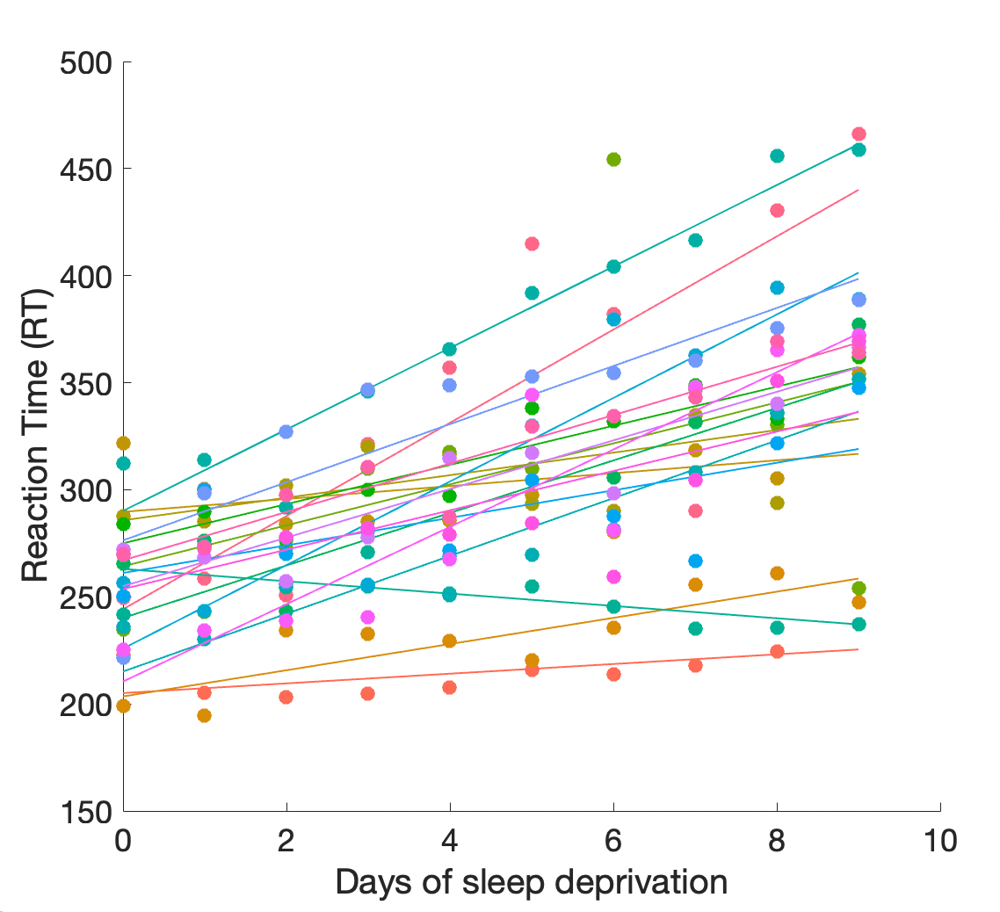
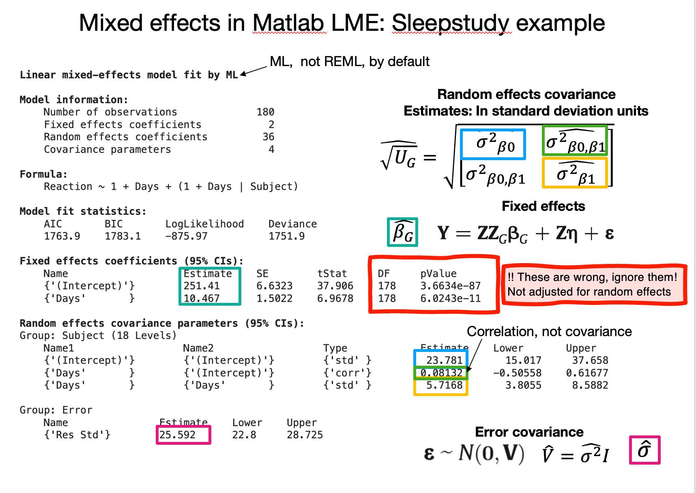
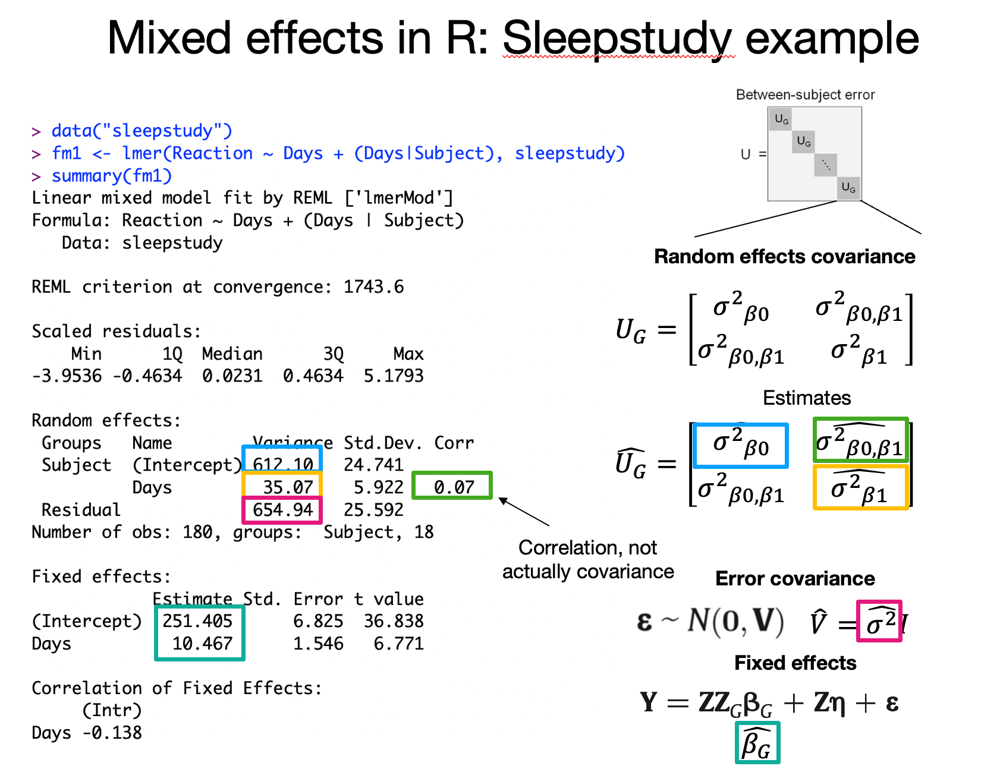
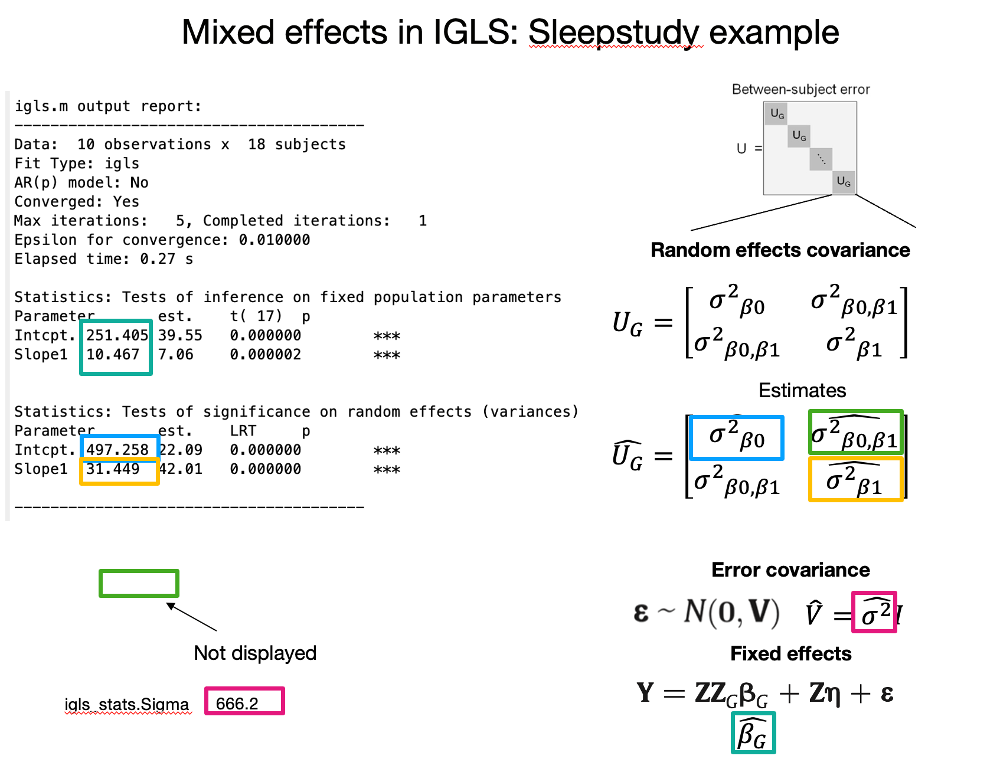
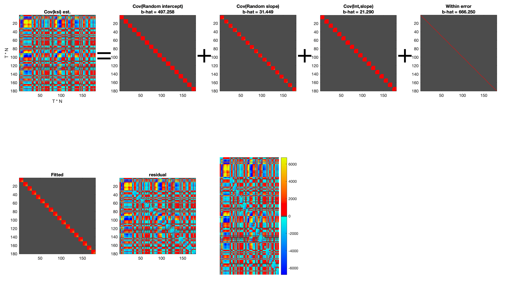
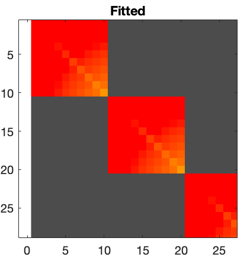

# Mixed effects: Examples

## Ashar dataset

Now that we've loaded the Ashar back pain dataset, we can try running a mixed effects model and compare.

Instead of organizing data in a "wide format" table with one row per participant, we can use the "long format" table, in which $y$ (i.e., Pain) is an $[mk x 1]$ vector with $k$ values measured for each of $m$ participants. We model the correlation between within-person repeated measures (Pre and Post-treatment pain) by including a random effect of participant in the error model.

[Download the Matlab live script](matlab_live/ashar_backpain_lme_example.mlx)

<iframe src="matlab_html/ashar_backpain_lme_example.html" width="120%" height="800px"></iframe>

## Sleepstudy dataset

This is a classic, and well-behaved, dataset included in R. We include it for comparison across methods and output.

Here is a plot of the data (generated using part of the script below)

We'll fit this 3 ways:
- Matlab fitlme
- CANlab IGLS
- CANlab glmfit_multilevel

[Download the Matlab live script](matlab_live/sleepstudy_lme_example.mlx)

<iframe src="matlab_html/sleepstudy_lme_example.html" width="120%" height="800px"></iframe>

## Comparing output from different packages

Let's identify some key corresponding output in each model.

### fitlme

### lmer in R

### IGLS

## Activities
1. Fit the same model in R and/or python
2. Make a table comparing t-values, P-values, and dfe for the different methods (3 here and 1-2 new ones)
3. Compare effects of different options (e.g., ReML vs. ML, bootstrap)

##Mixed effects in Python

Mixed effects models are available in R (lmer, lme4) and Matlab (fitlme and related others).

There are a couple of options in Python, though I'm not sure how well validated these are.
Python can reportedly access LMER in R using rpy2 and %Rmagic or Pymer4

Here are some possibly helpful links:
https://www.pythonfordatascience.org/mixed-effects-regression-python/
https://towardsdatascience.com/how-to-run-linear-mixed-effects-models-in-python-jupyter-notebooks-4f8079c4b589
https://gist.github.com/jcheong0428/f25b47405d9d328691c102787bc92175

Google Colab notebook
https://gist.github.com/jcheong0428/f25b47405d9d328691c102787bc92175

https://www.statsmodels.org/stable/examples/notebooks/generated/mixed_lm_example.html
